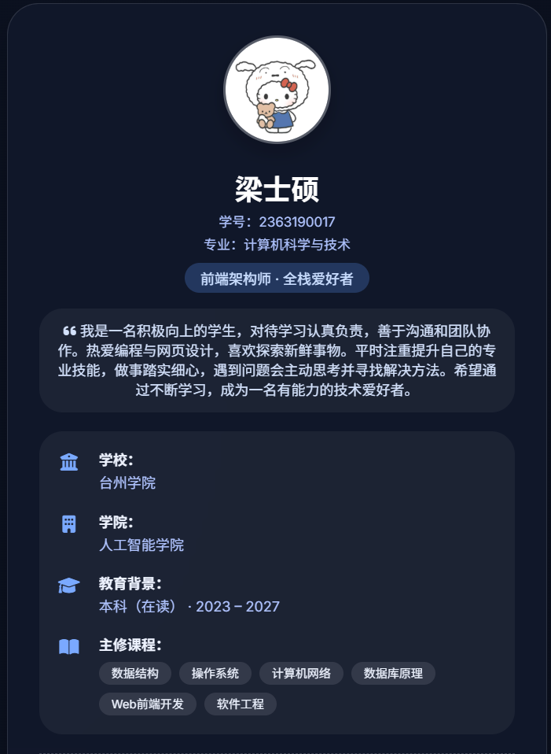
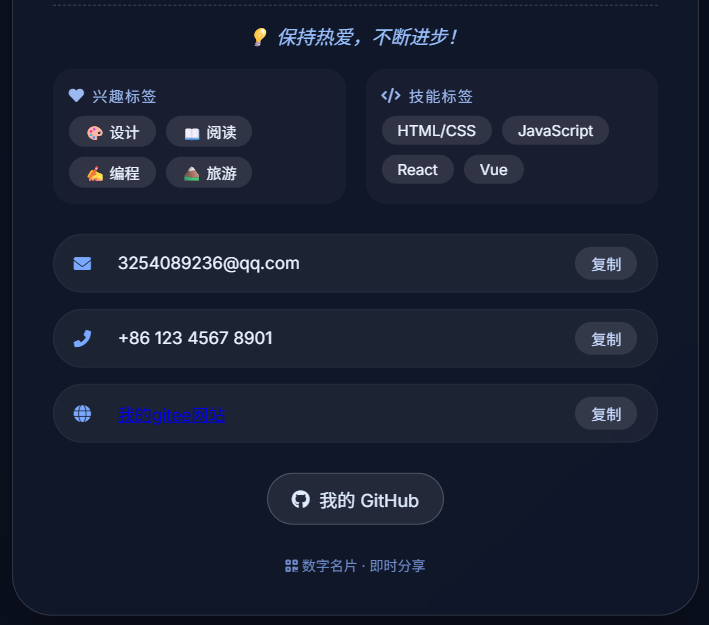

# 一、作品名称

个人数字名片

## 二、作品简介

本作品由本人独立设计并开发，是一款基于 HTML、CSS、JavaScript 实现的响应式个人数字名片网页。结合自身对前端视觉设计和交互体验的理解，选定毛玻璃视觉风格为核心设计方向，自主规划了个人信息展示、教育背景、技能兴趣、联系方式等全模块内容布局，同时开发了一键复制联系方式的实用交互功能，适配移动端与桌面端多设备尺寸，最终实现一款轻量化、个性化的个人数字化形象展示载体。

## 三、页面主要内容说明
- **页面效果展示**：
   
   

- **基础信息区**：自主设计圆形头像搭配核心信息的展示形式，呈现姓名、学号、专业及个人前端学习定位，视觉上突出信息层级，符合个人展示的核心需求；
- **自我介绍区**：以自定义的引用样式呈现个人学习态度、前端学习规划等内容，文字内容均为个人真实表述，贴合自身学习现状；
- **教育背景区**：独立设计 “图标 + 文字” 的展示结构，自主梳理学校、学院、就读阶段等信息，将主修课程以标签化形式呈现，让内容展示更清晰直观；
- **个性化内容区**：结合自身真实兴趣和技能掌握情况，设置个性签名、兴趣标签和技能标签，标签内容均为个人实际情况，拒绝模板化表述；
- **联系方式区**：展示个人常用的邮箱、电话、开源平台网址，为每个条目设计并开发复制按钮，实现一键复制功能，贴合实际使用场景；
- **外部链接区**：配置个人实际的 GitHub 跳转入口，为个人开源项目和学习代码提供展示渠道；
- **交互反馈区**：自主设计点击复制按钮后的 Toast 提示框效果，实现操作后的即时反馈，提升页面使用体验。

## 四、文件结构说明
├── index.html # 由本人独立编写，搭建所有内容模块的HTML骨架，规划页面整体结构
├── style.css # 自主编写样式代码，实现毛玻璃核心效果、响应式布局及所有组件的样式美化
├── script.js # 独立开发交互逻辑代码，实现剪贴板复制、Toast提示框显示隐藏等功能
└── images/ # 自定义头像图片存放目录，需放入个人头像文件my-photo.jpg

## 五、页面公开访问方式说明

- **本地访问**：将所有文件放入同一目录，确保 `images` 文件夹下放入个人头像文件 `my-photo.jpg`，直接双击 `index.html` 文件，通过任意浏览器即可打开访问；
- **在线部署访问**：本项目已通过 GitHub Pages 完成静态部署，可直接访问公开在线地址： https://likxic.github.io/ ，全球均可正常打开查看完整数字名片页面。

## 六、体现 “软件作品” 而非 “单一页面” 的核心点

本作品并非简单的静态页面制作，而是由本人以软件开发的思维完成整体设计与开发，从需求规划、模块化设计、功能开发到兼容性优化，全程体现软件作品的特性，核心亮点如下：

- **需求与功能设计**：从个人展示的实际需求出发，自主规划页面所有功能模块，开发一键复制联系方式的实用功能，而非简单套用模板，具备明确的功能设计思路；
- **模块化开发思想**：开发过程中，将 HTML 按 “功能模块” 拆分（教育背景、联系方式等独立区块），CSS 按 “全局样式 - 组件样式 - 响应式样式” 分层编写，JavaScript 封装独立的功能函数（`showToast` / `copyToClipboard`），让代码具备良好的可维护性和扩展性，符合软件模块化开发规范；
- **完整的交互闭环**：独立开发 “复制联系方式” 的全流程逻辑，包含原生剪贴板 API 调用、低版本浏览器兼容降级方案设计、操作后的 Toast 提示反馈，实现完整的 “用户操作 - 系统响应” 交互闭环，具备软件的交互特性；
- **多终端适配优化**：自主针对移动端（500px 以下）做布局、字体、间距的全维度自适应调整，手动调试不同设备的显示效果，确保多终端使用体验一致，满足软件的多场景使用需求。

## 七、AI 辅助开发说明

### 1. 是否使用 AI

是，开发过程中将 AI 作为辅助工具，仅用于解决部分技术细节问题，核心的页面设计、功能规划、代码编写与调试均由本人独立完成。

### 2. 使用的 AI 工具

辅助工具：豆包、deepseek、Cursor（内置 AI 代码补全）  
用途：仅用于技术问题咨询、代码细节参考，无全程依赖任何 AI 工具。

### 3. 关键提示词（2-4 条）

- 提示词 1：“毛玻璃效果的 CSS 核心属性有哪些，如何在网页中实现自然的毛玻璃视觉效果”
- 提示词 2：“JavaScript 中调用剪贴板 API 实现复制文本功能，如何做低版本浏览器的兼容处理”
- 提示词 3：“如何用 CSS 和 JS 实现点击按钮后的 Toast 提示框，要求显示 1.5 秒后自动隐藏”

### 4. AI 主要帮助的部分

AI 仅在技术细节参考层面提供辅助，未参与任何核心设计与开发，具体辅助点为：
- 咨询毛玻璃效果实现的核心 CSS 属性，作为本人编写样式代码的技术参考；
- 参考剪贴板 API 的基础调用语法，为本人开发兼容方案提供思路；
- 了解 Toast 提示框的基础实现逻辑，作为本人设计交互反馈效果的参考。

### 5. 对 AI 结果做的修改与自主开发

AI 仅提供零散的技术知识点和基础代码片段，本人对所有 AI 输出内容进行了大幅改造、自主拓展并独立完成全量开发，核心工作如下：

- **样式开发**：基于 AI 提及的毛玻璃核心属性，自主编写完整的 CSS 样式代码，设计毛玻璃卡片的整体视觉效果，搭配个人选定的配色、字体和间距，实现响应式布局并手动调试所有设备的显示效果，并非直接使用 AI 生成的样式；
- **功能开发**：参考剪贴板 API 的基础语法，由本人独立编写完整的复制功能逻辑，设计兼容降级方案，自主封装 `copyToClipboard` 函数，同时独立开发 `showToast` 函数，实现提示框的自定义显示时长和样式，补充无复制内容时的容错逻辑；
- **页面搭建**：完全由本人自主规划页面结构，编写所有 HTML 代码，设计模块展示形式，梳理个人信息并完成内容填充，未使用任何 AI 生成的页面结构模板；
- **细节优化**：自主调整所有交互细节，如按钮 hover 效果、标签动画、页面悬浮效果等，手动调试解决移动端布局溢出、标签换行异常等问题，确保页面的视觉效果和使用体验符合个人设计要求。

### 6. AI 最不可靠的一点

AI 仅能提供通用的技术知识点和碎片化的基础代码，无法贴合具体的开发需求，也不具备实际的开发思维，核心问题为：

- 提供的代码片段缺乏实用性，未结合本项目的页面结构和设计需求，直接使用会出现样式冲突、逻辑报错等问题，必须由本人重新编写和调试；
- 技术建议较为笼统，无法解决实际开发中的细节问题，如移动端适配的具体间距调整、交互效果的细节优化等，均需要本人自主思考和调试；
- 缺乏整体的开发逻辑，无法从项目需求出发提供完整的解决方案，仅能回答单一的技术问题，核心的项目设计、模块规划、代码整合均需本人独立完成。
